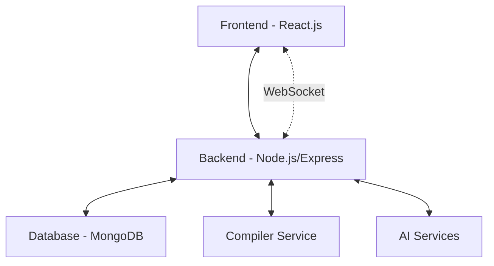
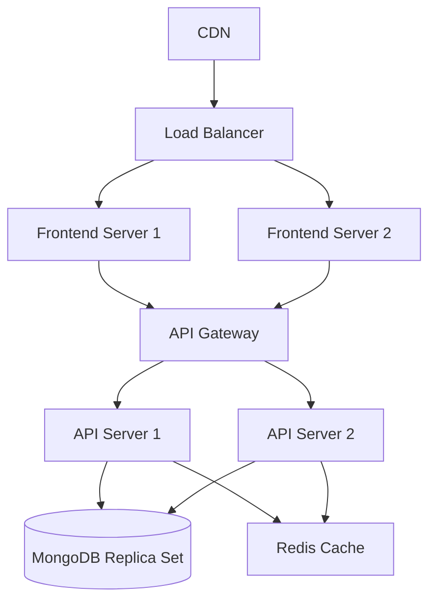

# ByteSmith - High-Level Design (HLD) Document

## Table of Contents
1. [System Overview](#1-system-overview)
2. [Architecture](#2-architecture)
   - [High-Level Architecture](#21-high-level-architecture)
   - [Technology Stack](#22-technology-stack)
3. [Core Components](#3-core-components)
   - [Frontend Components](#31-frontend-components)
   - [Backend Services](#32-backend-services)
4. [Data Models](#4-data-models)
   - [User](#41-user)
   - [Problem](#42-problem)
   - [Submission](#43-submission)
5. [API Endpoints](#5-api-endpoints)
6. [Security Considerations](#6-security-considerations)
7. [Scalability](#7-scalability-considerations)
8. [Deployment Architecture](#8-deployment-architecture)
9. [Future Enhancements](#9-future-enhancements)
10. [Monitoring and Logging](#10-monitoring-and-logging)

## 1. System Overview

ByteSmith is an intelligent coding learning platform that provides an interactive environment for learning algorithms and data structures. It features a web-based IDE, real-time code execution, and AI-powered assistance.

## 2. Architecture

### 2.1 High-Level Architecture



### 2.2 Technology Stack

#### Frontend
- **Framework**: React.js with Vite
- **Styling**: TailwindCSS
- **State Management**: React Context API
- **Real-time**: WebSocket
- **HTTP Client**: Axios

#### Backend
- **Runtime**: Node.js
- **Framework**: Express.js
- **Authentication**: JWT
- **Database**: MongoDB with Mongoose
- **WebSocket**: ws

#### Compiler Service
- **Languages**: C, C++, Java, Python, JavaScript
- **Execution**: Node.js child processes
- **Sandboxing**: Docker (recommended for production)

#### AI Services
- **Provider**: Google's Gemini API
- **Features**: Code analysis, hint generation

## 3. Core Components

### 3.1 Frontend Components

#### Authentication
- User registration and login flows
- Session management
- Protected routes

#### Problem Interface
- Code editor with syntax highlighting
- Problem statement renderer
- Test case visualization
- Submission history

#### Real-time Compiler
- WebSocket client
- Code execution status
- Output/error display

#### Admin Dashboard
- User management
- Problem CRUD operations
- Analytics dashboard

### 3.2 Backend Services

#### API Server
- RESTful endpoints
- Request validation
- Rate limiting
- Error handling

#### WebSocket Server
- Real-time communication
- Session management
- Resource allocation

#### Compiler Service
- Code execution
- Resource limiting
- Security sandboxing

#### AI Integration
- Code analysis
- Intelligent hints
- Solution verification

## 4. Data Models

### 4.1 User
```javascript
{
  _id: ObjectId,
  username: { type: String, required: true, unique: true },
  email: { type: String, required: true, unique: true },
  password: { type: String, required: true },
  role: { type: String, enum: ['user', 'admin'], default: 'user' },
  createdAt: { type: Date, default: Date.now },
  updatedAt: { type: Date, default: Date.now }
}
```

### 4.2 Problem
```javascript
{
  _id: ObjectId,
  title: { type: String, required: true },
  description: { type: String, required: true },
  difficulty: { type: String, enum: ['easy', 'medium', 'hard'], required: true },
  constraints: [{ type: String }],
  examples: [{
    input: String,
    output: String,
    explanation: String
  }],
  testCases: [{
    input: String,
    output: String,
    isPublic: Boolean
  }],
  tags: [{ type: String }],
  createdAt: { type: Date, default: Date.now },
  updatedAt: { type: Date, default: Date.now }
}
```

### 4.3 Submission
```javascript
{
  _id: ObjectId,
  problemId: { type: ObjectId, ref: 'Problem', required: true },
  userId: { type: ObjectId, ref: 'User', required: true },
  code: { type: String, required: true },
  language: { type: String, required: true },
  status: { 
    type: String, 
    enum: ['pending', 'accepted', 'wrong_answer', 'time_limit_exceeded', 'runtime_error', 'compilation_error'],
    default: 'pending'
  },
  testResults: [{
    testCaseId: ObjectId,
    status: String,
    output: String,
    expectedOutput: String,
    executionTime: Number,
    memoryUsed: Number
  }],
  createdAt: { type: Date, default: Date.now }
}
```

## 5. API Endpoints

### Authentication
- `POST /api/auth/register` - Register new user
- `POST /api/auth/login` - User login
- `GET /api/auth/profile` - Get user profile
- `POST /api/auth/refresh` - Refresh access token

### Problems
- `GET /api/problems` - List all problems
- `GET /api/problems/:id` - Get problem details
- `POST /api/problems` - Create problem (admin)
- `PUT /api/problems/:id` - Update problem (admin)
- `DELETE /api/problems/:id` - Delete problem (admin)

### Submissions
- `POST /api/submissions` - Submit code
- `GET /api/submissions` - List user submissions
- `GET /api/submissions/:id` - Get submission details

### Users
- `GET /api/users` - List users (admin)
- `GET /api/users/:id` - Get user details
- `PUT /api/users/:id` - Update user
- `DELETE /api/users/:id` - Delete user (admin)

## 6. Security Considerations

### Authentication & Authorization
- JWT-based stateless authentication
- Password hashing with bcrypt
- Role-based access control
- Token refresh mechanism

### Data Protection
- Environment variables for secrets
- Input validation and sanitization
- HTTPS enforcement
- CORS configuration
- Rate limiting

### Code Execution
- Time and memory limits
- Process isolation
- Input/output sanitization
- Resource monitoring

## 7. Scalability Considerations

### Horizontal Scaling
- Stateless API design
- Load balancing
- Database sharding
- Caching layer (Redis)

### Performance
- Database indexing
- Query optimization
- Response compression
- Asset minification

### Availability
- Database replication
- Load balancing
- Failover mechanisms
- Regular backups

## 8. Deployment Architecture



## 9. Future Enhancements

### Learning Features
- Interactive tutorials
- Video explanations
- Progress tracking
- Skill assessments

### Community
- Discussion forums
- Code reviews
- User profiles
- Achievement system

### Advanced Analytics
- Performance metrics
- Code quality analysis
- Learning path recommendations
- Problem difficulty calibration

### Integrations
- GitHub integration
- IDE plugins
- Mobile applications
- Third-party authentication

## 10. Monitoring and Logging

### Application Monitoring
- Error tracking (Sentry)
- Performance monitoring
- User analytics
- Uptime monitoring

### Infrastructure Monitoring
- Server health
- Resource utilization
- Network latency
- Database performance

### Logging
- Centralized logging (ELK Stack)
- Structured logging format
- Log rotation and retention
- Alerting system
